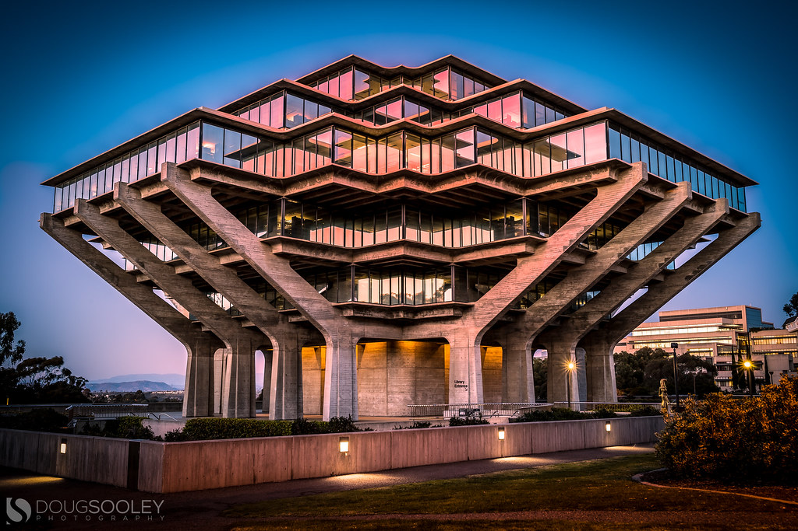
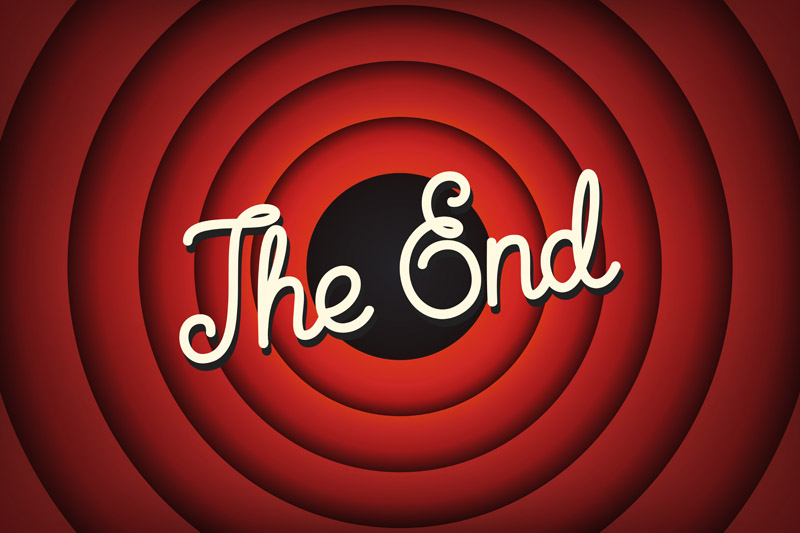

## Clarissa's Page 
###### *September 29, 2020*

> This is my last year at UCSD.

Hi! My name is Clarissa. Welcome to my page:)

## Code Fun fact
From the different types of loops that exist, the one I like the most is the for loop.

```
for( int i = 0; i < 100 ; i++ ){
    System.out.println(i);
}
```

## Songs 
One song that I liked a lot and is very inspiring is: [I lived- One Republic](https://www.youtube.com/watch?v=z0rxydSolwU)

## UCSD spots
My favorite spot at campus is Geisel Library: 


## Movies
Some of my favorite movies are:
- Divergent 
- The Intern (with Anne Hathaway)
- Top Gun: Maverick

## Programming Languages
My top programming languages are: 
1. Java
2. C++
3. HTML/CSS
4. JavaScript

## Classes
Classes I'm really interested in taking:
- [x] COGS 9
- [x] CSE 100
- [ ] CSE 110
- [ ] CSE 151A
- [ ] COGS 118A/B


A fun [meme](meme4.png) that happens to me.

To go back to top click [here](#clarissas-page) 


Thank you for visiting my page!

